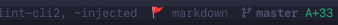

# QFBookmark (WIP 🚀)

<p align="center">
  
</p>

[**QFBookmark**](https://github.com/MadKuntilanak/qfbookmark) is yet another bookmarking plugin for Neovim that combines **marks**, **buffers**, **quickfix lists**, and **capturing notes** into a single workflow.

## 🌟 Features

- Mark lines with modes: `MARK`, `FIX`, `DEBUG`, `NOTE` (Mark Annotation)
- Harpoon-style popup with preview, symbol context (function/class/struct/impl), and per-entry highlights
- Treesitter-powered symbol resolution, shows enclosing function, class, struct, impl, or table context
* Persistent marks saved to disk per project, automatically separated and restored for each Git branch or tag, with support for merging marks across branches and tags
* Quickfix and location list integration with custom formatting, supporting both project-local and global save/load workflows
- Notes per project or globally (using external filetype definitions like org, norg, md, txt, etc.)
* Built-in quickfix integrations with trouble.nvim, grug-far.nvim, and fzf-lua (enabled by default, optional to disable)
- Fast navigation across all popup menus with jump shortcuts, plus optional number-based selection (similar to Harpoon) when `allow_number = true`
- Seamless item sharing across providers (**Mark**, **Quickfix**, **Buffers**, **Note**): add entries from marks, buffers, or other lists into quickfix and other supported targets directly from popup menus, with configurable custom integrations via `integrations.custom` commands

## 📸 Showcase


## 📦 Requirements

- Neovim >= 0.12
- [nvim-treesitter](https://github.com/nvim-treesitter/nvim-treesitter) (optional, for symbol context)
- [trouble](https://github.com/folke/trouble.nvim) (optional)
- [fzf-lua](https://github.com/ibhagwan/fzf-lua) (optional)
- [grug-far](https://github.com/MagicDuck/grug-far.nvim) (optional)

## ⚙️ Installation

**lazy.nvim**

```lua
{
  "MadKuntilanak/qfbookmark",
  event = "VeryLazy",
  opts = {},
}
```

**packer.nvim**

```lua
use {
  "MadKuntilanak/qfbookmark",
  config = function()
    require("qfbookmark").setup()
  end,
}
```

## 🛠️ Configuration

<details>
<summary>Default Configuration and Highlights</summary>

### Default configs

```lua
require("qfbookmark").setup {
  save_dir = vim.fn.stdpath "data" .. "/qfbookmark",

  -- Picker backend. "default" uses the built-in popup.
  picker = "default", --  or "fzf-lua"

  extmarks = {
    priority = 15,
    throttle = 200, -- ms

    -- Exclude certain buffer or file types from showing extmarks
    excluded = {
      buftypes = {},
      filetypes = {},
    },

    -- Mark mode definitions: icon, highlight group, and sign text
    keywords = {
      MARK = { icon = "📌", hl_group = "QFbookmarkBadgeMark" },
      FIX = { icon = "🔧", hl_group = "QFbookmarkBadgeFix" },
      DEBUG = { icon = "🚧", hl_group = "QFbookmarkBadgeDebug" },
      NOTE = { icon = "📝", hl_group = "QFbookmarkBadgeNote" },
    },
  },
  window = {
    notify = { mark = true, plugin = true, note = true, buffers = true },
    quickfix = {
      enabled = true,
      theme = {
        enabled = true,
        limit = 50,
        highlight = true,
        maxheight = 7,
      },
      actions = {
        copen = "belowright copen",
        lopen = "belowright lopen",
        auto_center = true, -- center buffer on jump
        auto_unfold = true,
        default = { auto_close = true },
        split = { auto_close = false },
        vsplit = { auto_close = false },
        tab = { auto_close = true },
      },
    },
    buffers = {
      enabled = true,
      allow_number = true,
      actions = {
        win_resized = true,
      },
    },
    mark = {
      enabled = true,
      anchor = "SE", -- NW/SW --- SE/NE
      allow_number = true,
      actions = {
        win_resized = false,
      },
      context_templates = {
        -- `separator` defines the string inserted between multiple contexts
        -- when more than one annotation is selected for preview/send.
        -- Set to `nil` to join them with a blank line, or provide a custom
        -- string for a more visible divider.
        -- Example: "\n\n" .. string.rep("─", 60) .. "\n\n"
        separator = nil,

        -- `default` sets which template is pre-selected when the preview
        -- popup opens. Must match a key inside `handler`.
        -- If unset or the key is not found, falls back to the first
        -- entry in `handler`, then to the builtin "copy_raw".
        default = "",

        -- `handler` is a map of named templates. Each entry defines how
        -- the annotation context is formatted before sending or copying.
        -- The `builder` function receives a `ctx` table with:
        --   ctx.text      → the short note the user typed
        --   ctx.lines     → the actual code lines covered by the annotation range
        --   ctx.filetype  → filetype of the source buffer
        --   ctx.filepath  → absolute path of the source file
        --   ctx.category  → annotation category (mark/fix/debug/note/etc)
        --   ctx.range     → { start_row, start_col, end_row, end_col } (0-indexed)
        -- The function must return a string.
        handler = {},
      },
      sinks = {
        -- `default` sets which sink is triggered by <CR> in the preview popup.
        -- Set to "" or omit to fall back to the builtin clipboard sink.
        -- Must match a key inside `handler`.
        default = "", -- fallback: clipboard (builtin, always available)

        -- `handler` is a map of named sink functions.
        -- Each function receives the final formatted string and is responsible
        -- for delivering it (e.g. sending to an AI plugin, writing to a file).
        -- Builtin "clipboard" is always available even if not listed here.
        handler = {},
      },
    },
    note = {
      -- Cursor state:
      -- The last cursor position is saved automatically.
      -- When reopening the note, the cursor will be restored
      -- to its previous location, so you don't need to scroll
      -- through long notes again.
      enabled = true,

      mode = "float", -- or "belowright split"
      wrap = true,
      anchor = "SE", -- "NW|NE|SW|SE"
      width = 0.45, -- relative size (0.1 to 1)
      height = 0.80,

      -- `current_project` controls where local (per-project) notes are saved.
      -- When `enabled = true`, notes are written to a file named `filename`
      -- inside the current working directory (i.e. the project root).
      -- This keeps project-specific notes self-contained alongside the codebase.
      --
      -- `filename` can be a plain filename (resolved relative to cwd)
      -- or an absolute path to a fixed location.
      -- Examples:
      --   filename = "TODO.org"          → <cwd>/TODO.org
      --   filename = "/home/user/notes/work.md"  → fixed absolute path
      --
      -- Global notes are always stored separately under `save_dir`
      -- and are shared across all projects and workspaces.
      current_project = {
        enabled = true,
        filename = "TODO.org",
      },
      insert_to_note = {
        enabled = false,
        line_placeholder = "<TEXT_HERE>", -- define whatever you like
        -- `templates` defines named note templates available when inserting
        -- an annotation into a note file (triggered via `insert_to_note`).
        -- Each key becomes a callable template that the user can bind to a mapping.
        --
        -- Each entry accepts the following fields:
        --
        --   `target`      Where the note is written to.
        --                 Accepted values:
        --                   "global"      → the global note file (under `save_dir`)
        --                   "local"       → the project-local file (see `current_project`)
        --                   "/path/to/file" → an explicit absolute path
        --
        --   `description` A short human-readable label shown in pickers/help.
        --
        --   `templates`   The note body. Can be:
        --                   string   → used as-is, evaluated once at startup.
        --                              Useful for static content or content that
        --                              captures values at load time (e.g. os.date).
        --                   function → called each time the template is triggered,
        --                              so dynamic values (e.g. vim.bo.filetype,
        --                              tomorrow's date) are evaluated at insert time.
        --                 The placeholder `<TEXT_HERE>` (configurable via
        --                 `line_placeholder`) marks where the selected text or
        --                 annotation note will be inserted.
        templates = {},
      },
    },
  },
  keymaps = {
    actions = { -- General actions
      up = { "<C-p>", "<C-k>", "k" },
      down = { "<C-n>", "<C-j>", "j" },

      default = { "<CR>", "o" },
      split = "<C-s>",
      vsplit = "<C-v>",
      tab = "<C-t>",

      scroll_preview_up = "<C-u>",
      scroll_preview_down = "<C-d>",
      scroll_preview_up_fast = "<C-b>",
      scroll_preview_down_fast = "<C-f>",

      toggle_select = "<Tab>",
      diselect_all = "D",

      next_item = "<C-n>",
      prev_item = "<C-p>",

      quit = { "q", "<Esc>", "<C-c>", "<C-q>" },

      show_help = "g?",

      del_item = "dd",
      del_item_all = "dM",
    },

    mark = {
      -- Create marks
      add_mark = "<Leader>qq",
      add_fix = "<Leader>qf",
      add_debug = "<Leader>qd",
      add_mark_annotation = "<Leader>qn",

      preview_context = "S",
      edit_context = "E",
      toggle_preview = "<Leader>qP",
      toggle_range_signs = "<Leader>qp",

      toggle_open = "gl",

      save_annotation = "<C-o>",

      next_mark = "gn",
      prev_mark = "gp",

      del_mark = "dm",
      del_mark_buffer = "dM",

      move_item_down = "<a-n>",
      move_item_up = "<a-p>",

      zoom = "<C-z>",

      load_all = "<C-a>",

      -- Jump directly to harpoon slot N
      harpoon = {
        mark_1 = "<a-1>",
        mark_2 = "<a-2>",
        mark_3 = "<a-3>",
        mark_4 = "<a-4>",
        mark_5 = "<a-5>",
        mark_6 = "<a-6>",
        mark_7 = "<a-7>",
        mark_8 = "<a-8>",
        mark_9 = "<a-9>",
      },
      integrations = {
        custom = { enabled = false, commands = {} },
      },
    },
    quickfix = {
      next_hist = "gl",
      prev_hist = "gh",

      rename_title = "<Localleader>qR",

      add_item_to_qf = "tt",
      add_item_to_loc = "ty",

      open_toggle_qf = "<Leader>qj",
      open_toggle_loc = "<Leader>ql",

      save_or_load = "<Leader>qy",

      layout_up = "<c-k>",
      layout_down = "<c-j>",

      integrations = {
        trouble = { enabled = true, toggle_qflist = "Q", toggle_loclist = "L" },
        grugfar = { enabled = true, toggle = "<Localleader>gg" },
        copyline = { enabled = true, toggle = "<Leader>cc" },
        custom = { enabled = false, commands = {} },
      },
    },

    buffers = {
      toggle_open = "gb",
      integrations = {
        custom = { enabled = false, commands = {} },
      },
    },

    note = {
      toggle_open_global = "<Leader>fn",
      toggle_open_local = "<Leader>fN",
      layout_rotate = "<a-=>",
      integrations = {
        custom = { enabled = false, commands = {} },
      },
    },
  },
}
```

### Highlights

| Highlight Group | Description |
|---|---|
| `QFBookmarkQfLineNr` | Line number column in the quickfix/loclist window |
| `QFBookmarkQfFileBasename` | Basename of the file shown in quickfix entries |
| `QFBookmarkQfWarn` | Quickfix entries marked as warnings |
| `QFBookmarkQfText` | Default text of a quickfix entry |
| `QFBookmarkQfSep` | Separator between filename, line number, and text in quickfix entries |
| `QFBookmarkQfFile` | Filename/path shown in quickfix entries |
| `QFBookmarkQfError` | Quickfix entries marked as errors |
| `QFBookmarkQfHint` | Quickfix entries marked as hints |
| `QFBookmarkQfInfo` | Quickfix entries marked as info |
| `QFBookmarkEntrySelectedCheck` | Checkbox icon (`✓`) for a selected entry |
| `QFBookmarkEntryUnselectedCheck` | Checkbox icon (`○`) for an unselected entry |
| `QFBookmarkFloatBorder` | Border of the main popup window |
| `QFBookmarkPreviewFloatBorder` | Border of the preview popup window |
| `QFBookmarkPreviewCursorline` | Cursorline inside the preview window |
| `QFBookmarkPreviewFloatCursorLineNr` | Cursorline number inside the preview window |
| `QFBookmarkPreviewFloatTitle` | Title text of the preview window |
| `QFBookmarkFloatTitle` | Title text of the main popup window |
| `QFBookmarkPreviewFloatCursor` | Cursor highlight inside the preview window |
| `QFBookmarkPreviewFooter` | Footer text of the preview window |
| `QFBookmarkFloatFooter` | Footer text of the main popup window |
| `QFBookmarkFloatCursorLine` | Cursorline highlight across the entry currently under the cursor |
| `QFBookmarkEntryIdx` | Index number shown at the start of each entry |
| `QFBookmarkEntryHiddenFlag` | `h` flag for hidden buffers in the buffer list |
| `QFBookmarkEntryModifiedFlag` | `+` flag for modified (unsaved) buffers |
| `QFBookmarkEntryFlag` | `%`/`#` flag for the current/alternate buffer |
| `QFBookmarkNoteExtmarkNote` | Inline note virtual text for `NOTE`-mode marks |
| `QFBookmarkEntryPath` | Directory portion of a file path in an entry |
| `QFBookmarkNoteExtmarkNoteEx` | Inline note virtual text shown in the detail line preview |
| `QFBookmarkNoteExtmarkDebug` | Inline note virtual text for `DEBUG`-mode marks |
| `QFBookmarkNoteExtmarkFix` | Inline note virtual text for `FIX`-mode marks |
| `QFBookmarkNoteExtmarkMark` | Inline note virtual text for `MARK`-mode marks |
| `QFBookmarkEntryUnselectedCheckCursor` | Checkbox icon (`○`) for an unselected entry under the cursor |
| `QFBookmarkEntrySelectedCheckCursor` | Checkbox icon (`✓`) for a selected entry under the cursor |
| `QFBookmarkNormalFloat` | Default background/foreground of all popup windows |
| `QFBookmarkEntrySelected` | Background highlight for a selected entry's lines |
| `QFBookmarkEntrySymbolType` | Symbol kind icon/text (class, struct, interface, table) in the symbol line |
| `QFBookmarkEntryFnName` | Function/method name in the symbol line |
| `QFBookmarkEntryNote` | Note text attached to a mark |
| `QFBookmarkEntryDetail` | Preview text on an entry's detail line |
| `QFBookmarkBadgeDebug` | Mode badge for `DEBUG` marks |
| `QFBookmarkBadgeNote` | Mode badge for `NOTE` marks |
| `QFBookmarkBadgeFix` | Mode badge for `FIX` marks |
| `QFBookmarkBadgeMark` | Mode badge for `MARK` marks |
| `QFBookmarkEntrySelectTo` | Indicator shown when forwarding selected entries to another target |
| `QFBookmarkEntryBasename` | Filename (basename) portion of a path in an entry |
| `QFBookmarkEntryDirectory` | Directory value shown in the save-to-file footer |
| `QFBookmarkEntryLnum` | Line number (`:N`) shown in an entry's detail line |
| `QFBookmarkEntryCurrentFile` | Current-file indicator (`●`) next to an entry's path |

</details>

---

## 🧩 Providers

<details>
<summary><strong>Mark</strong></summary>

### Mark
___

https://github.com/user-attachments/assets/6a8d277a-0e93-4c9c-90ed-5ee59753cbe6

- Persistent bookmarks anywhere in your codebase, organized by type.
- Fast navigation through a Harpoon-style popup.
- Marks are automatically saved per Git branch or tag.
- Load and merge marks from master files, other branches, or projects.
- Multi-select entries with `<Tab>` (`keymaps.actions.toggle_select`).
- Clear selections with `keymaps.actions.diselect_all`.
- In the popup menu, jump directly to entries by number when `allow_number = true`.
- Toggle zoom the preview window when you need more space.
- Show current buffer mark indicators with a green bullet `●` (`QFBookmarkEntryCurrentFile` highlight).

> ⚠️
> Inside the mark popup, the delete keymaps live under `keymaps.actions.del_item`
> (delete current entry) and `keymaps.actions.del_item_all` (delete all entries),
> these are separate from `del_mark` / `del_mark_buffer` below, which operate
> directly on a buffer rather than inside the popup.


> If you don't need this feature, you can disable it via `window.mark.enabled = false`.


#### Default Bookmark Types
___

| Type | Purpose |
|--------|----------|
| MARK | General bookmark |
| FIX | Something that needs fixing |
| DEBUG | Debugging location |
| NOTE | Mark Note Annotation |

#### Default Keymaps
___

```lua

    mark = {
      -- Create marks
      add_mark = "<Leader>qq",
      add_fix = "<Leader>qf",
      add_debug = "<Leader>qd",
      add_mark_annotation = "<Leader>qn",

      toggle_open = "gl",

      save_annotation = "<C-s>",

      del_mark = "dm",
      del_mark_buffer = "dM",

      next_mark = "gn",
      prev_mark = "gp",

      move_item_down = "<a-n>",
      move_item_up = "<a-p>",

      zoom = "<C-z>",

      load_all = "<C-a>",

      -- Jump directly to harpoon slot N
      harpoon = {
        mark_1 = "<a-1>",
        mark_2 = "<a-2>",
        mark_3 = "<a-3>",
        mark_4 = "<a-4>",
        mark_5 = "<a-5>",
        mark_6 = "<a-6>",
        mark_7 = "<a-7>",
        mark_8 = "<a-8>",
        mark_9 = "<a-9>",
      },
      integrations = {
        custom = { enabled = false, commands = {} },
      },
    },

```

#### Examples
___

??

</details>


<details>
<summary><strong>Quickfix</strong></summary>

### Quickfix
___

https://github.com/user-attachments/assets/eeee5cf4-948d-4c45-baea-0c1952d52903


- Quickfix and LocList integration with custom formatter.
- Navigate quickfix history with `next_hist` and `prev_hist`.
- Add the current line under cursor to quickfix  `add_item_to_qf` or loclist `add_item_to_loc`.
- Uses a default theme, which can be disabled via `window.quickfix.theme.enabled = false`.
- Multi-select entries with `<Tab>` (`keymaps.actions.toggle_select`).
- Clear selections with `keymaps.actions.diselect_all`.
- Save and load quickfix/loclist lists when needed `save_or_load`.
- Rename quickfix/loclist titles with `rename_title`.
- Move quickfix window layout using `layout_up` and `layout_down`.
- Delete items using `keymaps.actions.del_item` and `keymaps.actions.del_item_all`.
- Optional integrations support for `trouble.nvim`, `grug-far.nvim`, and custom commands.
- Disable unused integrations through the `integrations` config.

> If you don't need this feature, you can disable it via `window.quickfix.enabled = false`.


#### Default Keymaps
___

```lua

    quickfix = {
      next_hist = "gl",
      prev_hist = "gh",

      rename_title = "<Localleader>qR",

      add_item_to_qf = "tt",
      add_item_to_loc = "ty",

      open_toggle_qf = "<Leader>qj",
      open_toggle_loc = "<Leader>ql",

      save_or_load = "<Leader>qy",

      layout_up = "<c-k>",
      layout_down = "<c-j>",

      integrations = {
        trouble = { enabled = true, toggle_qflist = "Q", toggle_loclist = "L" },
        grugfar = { enabled = true, toggle = "<Localleader>gg" },
        copyline = { enabled = true, toggle = "<Leader>cc" },
        custom = { enabled = false, commands = {} },
      },
    },

```

#### Examples
___

??

</details>


<details>
<summary><strong>Buffers</strong></summary>

### Buffers
___

https://github.com/user-attachments/assets/ff2dc9f9-e281-4374-b6d7-c39ea20d0660

- Buffer management with a simple popup interface.
- Quickly browse and switch between open buffers.
- Multi-select entries with `<Tab>` (`keymaps.actions.toggle_select`).
- Clear selections with `keymaps.actions.diselect_all`.
- Optional custom integrations through the `integrations` config.
- In the popup menu, jump directly to entries by number when `allow_number = true`.
- Support custom basic commands for buffer actions (vsplit, split, open in tab)

> If you don't need this feature, you can disable it via `window.buffers.enabled = false`.


#### Default Keymaps
___

```lua

    buffers = {
      toggle_open = "gb",
      integrations = {
        custom = { enabled = false, commands = {} },
      },
    },

```

#### Examples
___

When you define `integrations.custom.enabled = true` under `buffers`, you can
attach custom commands to items in the buffer list popup. Each command receives
an `opts` table where `opts.selected` refers to the currently selected buffer entry.

The built-in method `opts.selected:add_to(target)` sends the selected buffer to
a destination. Accepted values for `target`:

- `"quickfix"` — adds the buffer to Neovim's quickfix list
- `"MARK"` — registers it as a general mark
- `"FIX"` — registers it as a fix mark
- `"DEBUG"` — registers it as a debug mark
- `"NOTE"` — registers it as a note annotation

Multi-select is supported out of the box — if you have multiple items selected
in the popup (via the toggle selection key), `opts.selected:add_to(target)` will
apply to all selected items at once. If nothing is selected, it falls back to
the item under the cursor.

> **Note:** `"NOTE"` is an exception to multi-select behavior. Because a note
> annotation requires user input (category, text, and range), adding a `NOTE`
> always operates on the single item under the cursor — even if multiple items
> are selected. Multi-selection is ignored in this case.

Example:


```lua
buffers = {
  integrations = {
    custom = {
      enabled = true,
      commands = {
        {
          key  = "sq",
          cmd  = function(opts) opts.selected:add_to "quickfix" end,
          desc = "Qf: add to quickfix",
        },
        {
          key  = "sd",
          cmd  = function(opts) opts.selected:add_to "DEBUG" end,
          desc = "Qf: add to debug mark",
        },
        {
          key  = "sn",
          cmd  = function(opts) opts.selected:add_to "NOTE" end,
          desc = "Qf: add to note mark",
        },
        {
          key  = "sf",
          cmd  = function(opts) opts.selected:add_to "FIX" end,
          desc = "Qf: add to fix mark",
        },
        {
          key  = "ss",
          cmd  = function(opts) opts.selected:add_to "MARK" end,
          desc = "Qf: add to mark",
        },
      },
    },
  },
},
```

Commands are buffer-local to the popup window and only active while it is open.
You can define as many entries as needed — each `key` is mapped in normal mode
by default unless `mode` is specified.


</details>

<details>
<summary><strong>Note</strong></summary>

### Note
___

https://github.com/user-attachments/assets/91599209-d31c-4fbf-a4d5-3c5b8aa48ea3


The note provider is just a way to capture text you'll want to check out
later. Enable it via `keymaps.note.integrations.custom`, and it'll insert
the captured text using whichever `templates` you've defined under
`insert_to_note`. You can also wire this up to integrate with your favorite
note-taking plugin (I personally use `orgmode`).

> If you don't need this feature, you can disable it via `window.note.enabled = false`.

```lua
insert_to_note = {
  enabled = true,
  -- the placeholder that gets replaced with the captured text
  line_placeholder = "<TEXT_HERE>",
  templates = {
    notice = {
      target = "global", -- "global", "local", or a custom file path (e.g. "your/path/file.txt")
      description = "Quick notice / reminder",
      templates = string.format(
        [[
     date: %s
     notice: I must check this later
     <TEXT_HERE>
     ]],
        os.date "%Y-%m-%d %H:%M"
      ),
    },
  },
}
```

> **Note:** `templates` can be defined as either a string or a function.
> Use a function when you need the template to be evaluated at runtime —
> for example, when it depends on values like `vim.bo.filetype` that should
> be read from the current buffer at insert time, rather than once when the
> config is first loaded.


#### Default Keymaps
___

```lua
note = {
  toggle_open_global = "<Leader>fn",
  toggle_open_local = "<Leader>fN",
  layout_rotate = "<a-=>", -- only works in non-float mode
  integrations = {
    custom = { enabled = false, commands = {} },
  },
},
```

#### Examples
___

```lua
insert_to_note = {
  enabled = true,
  line_placeholder = "<TEXT_HERE>",
  templates = {
    tomorrow = { ... },
    notice   = { ... },
    error    = { ... },
    todo     = { ... },
  },
},
```

Each key inside `templates` is a named template you can reference in your keymaps.  The `target` field controls where the captured text is written:
- `"global"` — the shared global note file (under `save_dir`)
- `"local"` — the project-local file (see `current_project.filename`)
- `"/absolute/path"` — a fixed file, e.g. an org-mode refile target

`templates` can be a **string** (evaluated once at startup, good for static content like a timestamp captured at load time) or a **function** (called each time the template is triggered, good for dynamic values like `vim.bo.filetype` or tomorrow's date from orgmode).

The string `<TEXT_HERE>` (or whatever you set `line_placeholder` to) marks where the selected text or annotation note will be inserted.

To trigger a template from a keymap, use `opts:add_note_to "<template_key>"` inside a custom command under `keymaps.note.integrations.custom`:

```lua
keymaps = {
  note = {
    integrations = {
      custom = {
        enabled = true,
        commands = {
          {
            key  = "<LocalLeader><LocalLeader>",
            cmd  = function(opts) opts:add_note_to "todo" end,
            mode = "v",
            desc = "Qf: capture todo",
          },
          {
            key  = "<LocalLeader>at",
            cmd  = function(opts) opts:add_note_to "tomorrow" end,
            mode = "v",
            desc = "Qf: remind me tomorrow",
          },
        },
      },
    },
  },
},
```

Visual-select the lines you want to capture, then press the mapped key.  The selected text replaces `<TEXT_HERE>` in the template, and the result is appended to the target file.

Example:


Config:

```lua
          insert_to_note = {
            enabled = true,
            line_placeholder = "<TEXT_HERE>",
            templates = {
              tomorrow = {
                target = RUtils.file.get_agenda_path "/orgmode/gtd/refile.org",
                description = "Remind me tomorrow",
                templates = function()
                  local Date = require "orgmode.objects.date"
                  local scheduled_date = Date.today().tomorrow()
                  return string.format(

                    [[
* TODO investigate this later                                   :mytodo:
  SCHEDULED: <%d-%s-%d %s 18:00>

  #+begin_src %s
  <TEXT_HERE>
  #+end_src
]],
                    scheduled_date.year,
                    #tostring(scheduled_date.month) == 1 and "0" .. scheduled_date.month or scheduled_date.month,
                    #tostring(scheduled_date.day) == 1 and "0" .. scheduled_date.day or scheduled_date.day,
                    scheduled_date.dayname,
                    vim.bo.filetype
                  )
                end,
              },
              notice = {
                target = "global",
                description = "Quick notice / reminder",
                templates = string.format(
                  [[
date: %s
notice:
<TEXT_HERE>
]],
                  os.date "%Y-%m-%d %H:%M"
                ),
              },

              error = {
                target = "local",
                description = "Capture an error / bug for this project",
                templates = string.format(
                  [[
date: %s
error:
<TEXT_HERE>
]],
                  os.date "%Y-%m-%d %H:%M"
                ),
              },

              todo = {
                target = "local",
                description = "TODO item with source reference",
                templates = function()
                  return string.format(
                    [[
  - [ ] error ..

    #+begin_src %s
    <TEXT_HERE>
    #+end_src

      ]],
                    vim.bo.filetype
                  )
                end,
              },
            },
          },

```

And under `keymaps` section

```lua
      keymaps = {
        note = {
          ...
          integrations = {
            custom = {
              enabled = true,
              commands = {
                {
                  key = "<LocalLeader><LocalLeader>",
                  cmd = function(opts)
                    opts:add_note_to "todo"
                  end,
                  mode = "v",
                  desc = "Qf: capture todo",
                },
                {
                  key = "<LocalLeader>at",
                  cmd = function(opts)
                    opts:add_note_to "tomorrow"
                  end,
                  mode = "v",
                  desc = "Qf: remind me tomorrow",
                },
              },
            },
          },
        },

```

</details>

## 🎨 Support statusline

Example using [heirline](https://github.com/rebelot/heirline.nvim)

 

<details>
<summary>Click to expand</summary>

```lua

local get_qfbookmark = function()
  if not qfbookmark then
    local ok, qfbook = pcall(require, "qfbookmark.qf")
    if ok then
      qfbookmark = qfbook
    end
  end
  return qfbookmark
end

...

M.QFbookmark = {
  condition = function()
    local qfbook = get_qfbookmark()
    if qfbook and qfbook.status_mark() then
      return true
    end
    return false
  end,
  {
    provider = function()
      return Cfg.icons.misc.flags .. " "
    end,
    hl = { fg = colors.diagnostic_err },
  },
}
```
</details>


## ❓ FAQ

<details>
<summary>Why another bookmark plugin?</summary>

[**QFBookmark**](https://github.com/MadKuntilanak/qfbookmark) was built around my own coding workflow. I often found myself placing marks in different files and later forgetting the context around them especially which function, method, or code section the mark referred to. This plugin extends the idea of traditional marks by combining them with quickfix lists, notes, and contextual navigation, making it easier to revisit and organize important locations across a project.

</details>

<details>
<summary>Why 4 mark types instead of one?</summary>

The four types (MARK, FIX, DEBUG, NOTE) don't change how marks work internally — they exist purely for visual clarity. When you have many marks across multiple files, being able to tell at a glance "this is a debugging point" vs "this needs fixing" vs "this is just a reference" makes navigation significantly faster. Think of them as colored sticky notes.
</details>

<details>
<summary>Can I use only one type and ignore the rest?</summary>

Yes. All four types behave identically under the hood. You can map only `MARK` and never touch the others.
</details>

<details>
<summary>What's Mark Note Annotation different from the others?</summary>

Mark Note Annotation is the only type that supports inline annotations. You can attach text to it, which is also exposed in the mark popup and can be leveraged by external AI plugins or custom integrations for additional context.
</details>

## 🙏 Acknowledgements

- [Fzf-lua](https://github.com/ibhagwan/fzf-lua)  
  The picker that inspired me a lot. I borrowed a few ideas along the way and occasionally peeked at the code. 👀

- [quicker.nvim](https://github.com/stevearc/quicker.nvim)  
  Helped me make quickfix look nicer and taught me that quickfix doesn't have to look like a 1990s terminal output.

- [folke](https://github.com/folke)  
  Creator of many incredible Neovim plugins. Basically one of the reasons my Neovim config keeps growing instead of getting smaller. 😅


## 📄 License

MIT
