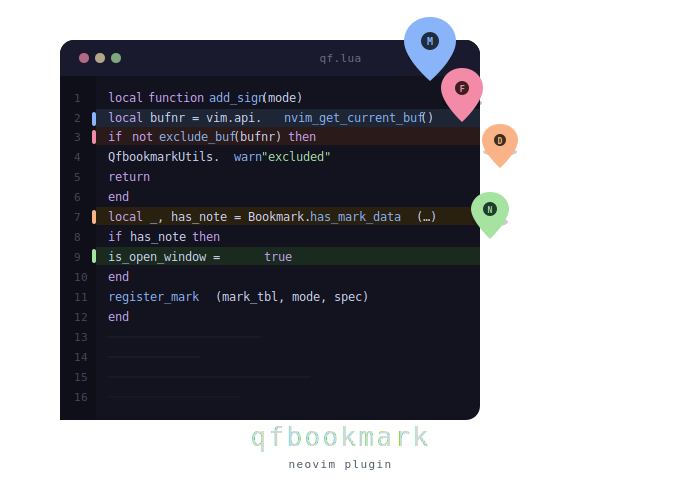
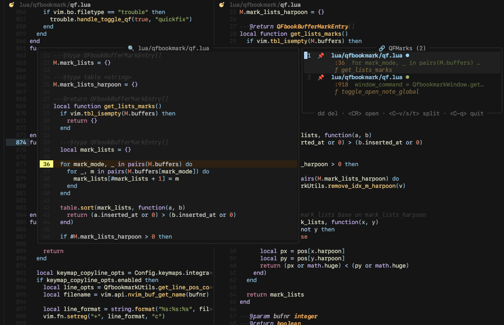

# QFbookmark

<p align="center">
  
</p>

[**qfbookmark**](https://github.com/MadKuntilanak/qfbookmark) was built around my own coding workflow. I often found myself placing marks in different files and later forgetting the context around them especially which function, method, or code section the mark referred to. This plugin extends the idea of traditional marks by combining them with quickfix lists, notes, and contextual navigation, making it easier to revisit and organize important locations across a project.


> **Note**

> WORK IN PROGRESS 🚀
>
> This plugin is actively developed and some features may not be fully polished yet. You may occasionally encounter bugs, breaking changes, or incomplete integrations as new functionality is added.
>
> Please report issues if you find any problems. 


## Features

- Mark lines with modes: `MARK`, `FIX`, `DEBUG`, `NOTE`
- Harpoon-style popup with preview, symbol context (function/class/struct/impl), and per-entry highlights
- Treesitter-powered symbol resolution — shows enclosing function, class, struct, impl, or table context
- Persistent marks saved to disk per project
- QuickFix and LocList integration with custom formatter
- Notes per project or globally (using external filetype definitions like org, norg, md, txt, etc.)
- Quickfix integrations: works with trouble.nvim, grug-far.nvim, and fzf-lua

## Showcasse



## Requirements

- Neovim >= 0.10
- [nvim-treesitter](https://github.com/nvim-treesitter/nvim-treesitter) (optional, for symbol context)
- [fzf-lua](https://github.com/ibhagwan/fzf-lua) (optional)

## Installation

**lazy.nvim**

```lua
{
  "MadKuntilanak/qfbookmark",
  event = "VeryLazy",
  opts = {},
}
```

**packer.nvim**

```lua
use {
  "MadKuntilanak/qfbookmark",
  config = function()
    require("qfbookmark").setup()
  end,
}
```

## Setup

```lua
require("qfbookmark").setup {
  -- all options shown with their defaults
}
```


---

## Configuration

<details>
<summary>Default configuration, click to expand</summary>

```lua
require("qfbookmark").setup {
  -- Directory where marks are persisted across sessions.
  save_dir = vim.fn.stdpath "data" .. "/qfbookmark",

  -- Picker backend. "default" uses the built-in popup.
  -- "fzf-lua" uses fzf-lua for fuzzy search.
  picker = "default",

  -- Extmark (inline sign) settings
  extmarks = {
    priority = 20,

    -- Exclude certain buffer or file types from showing extmarks
    excluded = {
      buftypes = {},
      filetypes = {},
    },

    throttle = 200, -- ms

    -- Mark mode definitions: icon, highlight group, and sign text
    keywords = {
      MARK = { icon = "📌", hl_group = "QFBookMark", alt = " -> " },
      FIX = { icon = "🔧", hl_group = "QFBookFix", alt = " -> " },
      DEBUG = { icon = "🚧", hl_group = "QFBookDebug", alt = " -> " },
      NOTE = { icon = "📝", hl_group = "QFBookNote", alt = " -> " },
    },
  },

  -- Window and UI settings
  window = {
    notify = {
      mark = true, -- notify when a mark is created/deleted
      plugin = true, -- notify plugin-level messages
    },
    quickfix = {
      enabled = true,
      copen = "belowright copen",
      lopen = "belowright lopen",
      theme = { enabled = true, limit = 50, highlight = true },
      actions = {
        auto_center = true, -- center buffer on jump
        auto_unfold = true,
      },
    },
    note = {
      -- Auto-save behavior:
      -- Changes are automatically saved when opening, closing, or toggling the note window.
      -- You don't need to manually save (no :w required),
      -- but you can still do it if you want to.

      -- Cursor state:
      -- The last cursor position is saved automatically.
      -- When reopening the note, the cursor will be restored
      -- to its previous location, so you don't need to scroll
      -- through long notes again.

      -- `open_cmd` can be either:
      --   string: Vim command used to open the note (e.g. "botright vsplit")
      --   table : floating window configuration
      --           { mode = "float", anchor = "NW|NE|SW|SE" }
      open_cmd = "botright vsplit",

      size = "50", -- or 12%

      -- Syntax highlighting is not provided by this plugin,
      -- it relies on nvim built-in filetypes or external plugins :D
      filetype = "org", -- "org" | "norg" | "md" | "txt"

      -- When enabled, notes are stored in a project-local file.
      -- The target path will follow `filename` (e.g. "TODO.org") inside the current project directory.
      -- This is useful for per-project notes (e.g. TODO.org per repo/workspace).

      -- Global notes are always stored separately in `save_dir`,
      -- and are shared across all projects/workspaces.
      current_project = {
        enabled = true,
        filename = "TODO.org",
      },
    },
    mark = {
      anchor = "SE",
      on_send = nil,
      keymap = {
        up = "",
        down = "",
        move_item_down = "<a-n>",
        move_item_up = "<a-p>",

        select = "<Tab>",
        zoom = "<C-z>",

        load_all = "<F4>",

        scroll_preview_up = "<C-u>",
        scroll_preview_down = "<C-d>",
        scroll_preview_up_fast = "<C-b>",
        scroll_preview_down_fast = "<C-f>",
      },
    },
  },

  -- Keymaps
  keymaps = {
    -- Set to true to disable all default keymaps and define your own
    disable_all = false,

    actions = {
      delete_mark = "dm",
      delete_mark_buffer = "dM",
      delete_item = "dd",
      delete_item_all = "<Localleader>qC",
      rename_title = "<Localleader>qR",

      save_or_load = "<Leader>qy",
      mark_win_open = "gp",
      buffers = "gn",

      -- Create marks
      mark = "<Leader>qq",
      fix = "<Leader>qf",
      debug = "<Leader>qd",
      note = "<Leader>qN",

      -- Jump directly to harpoon slot N
      harpoon = {
        mark_1 = "<a-1>",
        mark_2 = "<a-2>",
        mark_3 = "<a-3>",
        mark_4 = "<a-4>",
        mark_5 = "<a-5>",
        mark_6 = "<a-6>",
        mark_7 = "<a-7>",
        mark_8 = "<a-8>",
        mark_9 = "<a-9>",
      },
    },

    open_item = {
      default = { keys = { "o", "<CR>" }, auto_close = true },
      split = { keys = { "ss", "<C-s>" }, auto_close = false },
      vsplit = { keys = { "sv", "<C-v>" }, auto_close = false },
      tab = { keys = { "st", "tn" }, auto_close = true },
    },

    navigation = {
      quicklist = {
        next = "<a-n>",
        prev = "<a-p>",
        next_hist = "gl",
        prev_hist = "gh",
      },
      window = {
        move_up = "<c-k>",
        move_down = "<c-j>",
        rotate_layout_note = "<a-=>",
      },
      mark = {
        next = "gj",
        prev = "gk",
      },
    },

    quickfix = {
      toggle_open = "<Leader>qj",
      add_item = "tt",
    },
    loclist = {
      toggle_open = "<Leader>ql",
      add_item = "ty",
    },

    note = {
      toggle_local_note = "<Leader>fn",
      toggle_global_note = "<Leader>fN",
    },

    integrations = {
      trouble = { enabled = true, toggle_qflist = "Q", toggle_loclist = "L" },
      grugfar = { enabled = true, toggle = "<Localleader>gg" },
      copyline = { enabled = true, toggle = "<Leader>qc" },
      cmdline_strings = { enabled = false, commands = {} },
    },
  },
}
```
</details>

## Mark Popup

Open the mark popup with `gp` (default). Each entry shows:

```
 1  MARK  ui/init.lua ●
          :92  local path_width = calc…
          ƒ mark_harpoon_popup

 2  FIX   system_dbs.rs
          :12  DbType::Mysql => Se…
           SystemDb > ƒ is_system_db
```

---

## Default Bookmark Types

| Type | Purpose |
|--------|----------|
| MARK | General bookmark |
| FIX | Something that needs fixing |
| DEBUG | Debugging location |
| NOTE | Note location |

---

## Default Keymaps

### Bookmark Actions

| Key | Action |
|------|----------|
| qq | Add MARK |
| qf | Add FIX |
| qd | Add DEBUG |
| qn | Add NOTE |
| dm | Delete bookmark |
| dM | Delete all bookmarks in current buffer |

### Quickfix

| Key | Action |
|------|----------|
| qj | Toggle quickfix |
| tt | Add item to quickfix |

### Location List

| Key | Action |
|------|----------|
| ql | Toggle location list |
| ty | Add item to location list |

### Notes

| Key | Action |
|------|----------|
| fn | Toggle local note |
| fN | Toggle global note |

### Navigation

| Key | Action |
|------|----------|
| gj | Next bookmark |
| gk | Previous bookmark |
| gl | Next list history |
| gh | Previous list history |

---

## Disable All Default Keymaps

```lua
require("qfbookmark").setup {
  keymaps = {
    disable_all = true,
  },
}
```

Then define only the mappings you want.


## Integrations

### [**Trouble**](https://github.com/folke/trouble.nvim)

```lua
integrations = {
  tbbuble = {
    enabled = true,
    toggle_qflist = "Q",
    toggle_loclist = "L",
  },
}
```

### [**Grug Far**](https://github.com/MagicDuck/grug-far.nvim)

```lua
integrations = {
  grugfar = {
    enabled = true,
    toggle = "<Localleader>gg",
  },
}
```
### [fzf-lua](https://github.com/ibhagwan/fzf-lua) 

Set `picker = "fzf-lua"` to use fzf-lua for fuzzy searching marks.


## FAQ

**Why 4 mark types instead of one?**

The four types (MARK, FIX, DEBUG, NOTE) don't change how marks work internally — they exist purely for visual clarity. When you have many marks across multiple files, being able to tell at a glance "this is a debugging point" vs "this needs fixing" vs "this is just a reference" makes navigation significantly faster. Think of them as colored sticky notes.

**Can I use only one type and ignore the rest?**

Yes. All four types behave identically under the hood. You can map only `MARK` and never touch the others.

**What's NOTE different from the others?**

NOTE is the only type that supports inline annotations,  you can attach text to it, which is also exposed to the mark popup and can be sent to AI plugins for context.


## License

MIT
